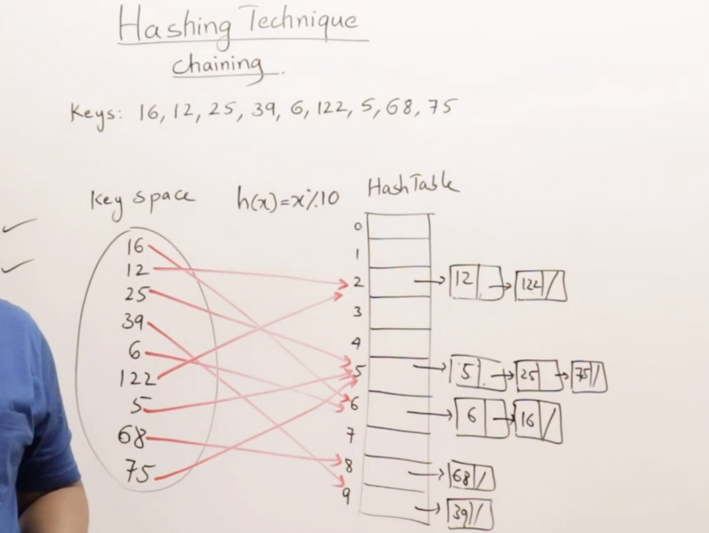
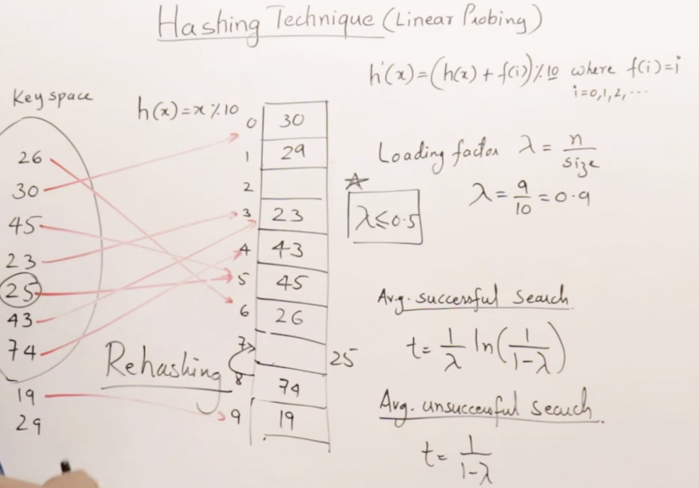
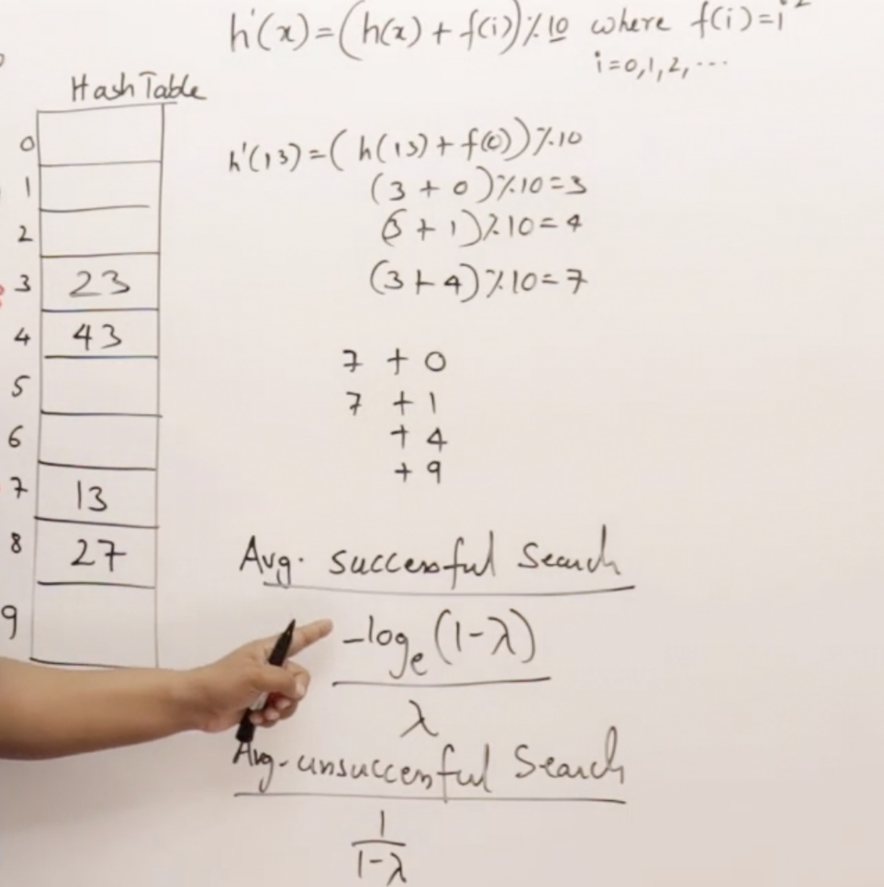
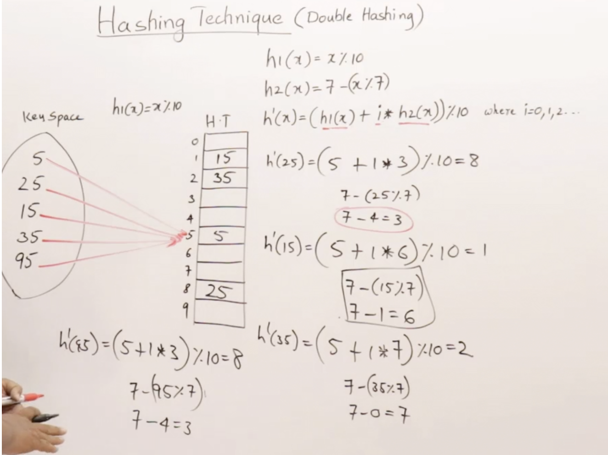

# Hashing

### Why Hashing?

Hashing is mainly to improve the search time lower than $Log(n)$ time, and approaching to the constant time.

Coz we have O(n) time for **linear Search** and O(logN) time for **binary search**, but we have to spend more time on sorting if the array is unordered.


### Drawback?

The ideal hashing tech, $h(x)=x$, the length of the array should be larger than the biggest number.

### Solutions?

if we smaller the length of the table, it has to encounter the collusion. So how to avoid the collision is essential.

**Open Hashing** 

* Chaining

**Closed Hashing**

* Linear Probing 
* Quadric Probing
* Double Hashing


About Load Factor, $\lambda=n/size$, n means the number of keys, and size is the number of the table.

The most important thing in Hashing is that the Load factor has to be smaller than 0.5. $\lambda\leq0.5$.


### Chaining

Chaining is a technology used for avoiding collision in hash tables.

In the Chaining approach, the hash table is an array of LinkedList, each index has its own linked list.

All the key-value pairs will be stored in the linked list of that index.

**Analysis.**

```
 m = Number of slots in hash table
 n = Number of keys to be inserted in hash table
 
 Load factor α = n/m 
  
 Expected time to search = O(1 + α)
 
 Expected time to delete = O(1 + α)

Time to insert = O(1)

 Time complexity of search insert and delete is 
 O(1) if  α is O(1)
```

**Benefits**.

Through chaining, insertion in a hash table will occur in O(1) since linked lists allow insertion in constant time.

A chained hash table will never be resized and it can grow infinitely if space is enough.



### Linear Probing 

The Linear Probing's solution. 

$h'(x)=(h(x)+f(i))\%10,f(i)=i,h(x)=x$

**Search,** search until the stack is null.




### Quadric Probing

$h'(x)=(h(x)+f(x))\%10, h(x)=x\%10, f(i) = i^2$



### Double Hashing

$h'(x)=(h_{1}(x)+i*h_{2}(x)\%table size),h_{1}=x\%table size,h_{2}=7-(x\%7)$

It's one of the best form of probing, producing a uniform distribution of records throughout a hash table.

The tech doesn't yield any clusters.

It's one of effective methods for resolving collisions.

