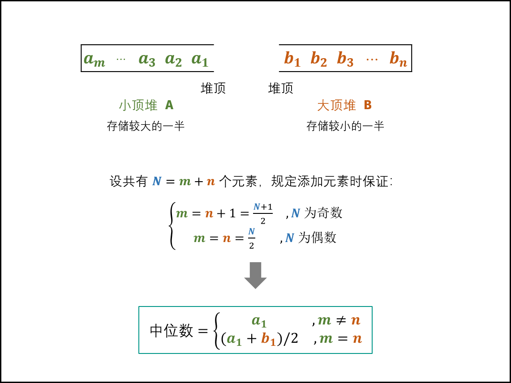

# 41. 数据流中的中位数

如何得到一个数据流中的中位数？如果从数据流中读出奇数个数值，那么中位数就是所有数值排序之后位于中间的数值。如果从数据流中读出偶数个数值，那么中位数就是所有数值排序之后中间两个数的平均值。

例如，

[2,3,4] 的中位数是 3

[2,3] 的中位数是 (2 + 3) / 2 = 2.5

设计一个支持以下两种操作的数据结构：

* void addNum(int num) - 从数据流中添加一个整数到数据结构中。
* double findMedian() - 返回目前所有元素的中位数。

示例1:

```
输入：
["MedianFinder","addNum","addNum","findMedian","addNum","findMedian"]
[[],[1],[2],[],[3],[]]
输出：[null,null,null,1.50000,null,2.00000]
```

示例 2：

```
输入：
["MedianFinder","addNum","findMedian","addNum","findMedian"]
[[],[2],[],[3],[]]
输出：[null,null,2.00000,null,2.50000]
```


限制：

* 最多会对 addNum、findMedian 进行 50000 次调用。


链接：https://leetcode-cn.com/problems/shu-ju-liu-zhong-de-zhong-wei-shu-lcof


## 解析

本题主要考察对数据结构的理解程度，需要对各个数据容器特点有很深刻的了解，了解各个容器的优劣，然后找出最优解。



本题主要使用大顶堆和小顶堆的方法进行求解，进一步优化时间复杂度，图解如上，[图片来源](https://leetcode-cn.com/problems/shu-ju-liu-zhong-de-zhong-wei-shu-lcof/solution/mian-shi-ti-41-shu-ju-liu-zhong-de-zhong-wei-shu-y/)。

将数据分为两个部分，如果数据总量为偶数，两个部分的大小相等，如果数据总量为奇数，将数据插入小顶堆A。小顶堆A存储数据较大的数据，大顶堆B存储数据较小的一半。

两个堆限制条件：

1. 因为要保证数据平均分配到两个堆中，所以两个堆堆饿数据之差不能超过1。
2. 保证最大堆中的数据都要小于最小堆中的所有数据。

数据如何插入？

1. 如果数据总数为偶数，将数据插入B，然后将B堆的堆顶元素插入A中。
2. 如果数据总数为奇数，将数据插入A，然后将A中的堆顶元素插入B中。

如何返回中位数？

1. 当数据总是为偶数，返回两个堆顶元素之和的一半即可。
2. 当数据总数为奇数，返回A的堆顶元素。

复杂度：

* 查找时间：取出堆顶元素需要O(1)
* 插入数据：堆的插入和弹出操作需要*O*(log*N*) 。

> PriorityQueue不保证插入数据顺序，但是保证队首元素总是优先级最高的元素。

## 题解

### Java

```java
class MedianFinder {
    Queue<Integer> HeapA, HeapB;
    /** initialize your data structure here. */
    public MedianFinder() {
        HeapA = new PriorityQueue<>();//创建小顶堆
        HeapB = new PriorityQueue<>((x, y) -> (y - x));//创建大顶堆
    }
    
    public void addNum(int num) {
      	//两者不等加到大根堆
        if(HeapA.size() != HeapB.size()){
            HeapA.add(num);
            HeapB.add(HeapA.poll());
        }else{//两者相等加到小根堆
            HeapB.add(num);
            HeapA.add(HeapB.poll());
        }
    }
    
    public double findMedian() {
        if(HeapA.size() != HeapB.size())
            return HeapA.peek();
        else
            return (HeapB.peek() + HeapA.peek()) / 2.0;
    }
}

/**
 * Your MedianFinder object will be instantiated and called as such:
 * MedianFinder obj = new MedianFinder();
 * obj.addNum(num);
 * double param_2 = obj.findMedian();
 */
//其中 findMedian方法可以简写为如下：
public double findMedian() {
        return A.size() != B.size() ? A.peek() : (A.peek() + B.peek()) / 2.0;
   }

```


### C++

```c++
class MedianFinder {
public:
   
    /** initialize your data structure here. */
    MedianFinder() {
        //Nothing Here
    }
    
    void addNum(int num) {
            //小根堆元素大于大根堆，将元素放入小根堆
            // if(HeapA.size() >= HeapB.size()){
            //     HeapB.push(num);
            // }else{
            //     HeapA.push(num);
            // }
            HeapA.size() > HeapB.size() ? HeapB.push(num) : HeapA.push(num);

            //交换元素，并删除对应元素
            if(!HeapB.empty() && HeapA.top() < HeapB.top()){
                HeapA.push(HeapB.top());
                HeapB.push(HeapA.top());
                HeapA.pop();
                HeapB.pop();
            }
        }
    
    double findMedian() {
        // int n1 = HeapA.size();
        // int n2 = HeapB.size();
        // if((n1 + n2) % 2 == 0){
        //     return (HeapA.top() + HeapB.top()) * 1.0 / 2;
        // }
				//通关判断数组是否相等来判断数量奇偶
        return HeapA.size() == HeapB.size() ? (HeapA.top() + HeapB.top()) * 1.0 / 2 : HeapA.top();
        // if(HeapA.size() == HeapB.size())
        //     return (HeapA.top() + HeapB.top()) * 1.0 / 2;
        // // return n1 > n2 ? HeapA.top() : HeapB.top();
        // return HeapA.top();
    }
private:
    priority_queue<int, vector<int>, greater<int>> HeapA;//创建小顶堆
    priority_queue<int, vector<int>, less<int>> HeapB;//创建大顶堆
};

/**
 * Your MedianFinder object will be instantiated and called as such:
 * MedianFinder* obj = new MedianFinder();
 * obj->addNum(num);
 * double param_2 = obj->findMedian();
 */
```


## 补充：

**关于大顶堆和小顶堆**

大顶堆：根节点的关键字是堆里所有结点关键字中最大者，为大顶堆。大顶堆的根节点关键字大于或等于左子树和右子树的关键字值。

小顶堆：根节点关键字是堆里所有结点关键字中最小值，为小顶堆。小顶堆根节点关键字小于或等于左子树和右子树的关键字值。

在Java中使用优先队列PriorityQueue默认自然顺序排序，也就是小顶堆。

PriorityQueue中peek( )方法和element( )方法都是像优先队列中插入元素，没有很大的差别。


---

参考：

[PriorityQueue](https://www.cnblogs.com/CarpenterLee/p/5488070.html)

